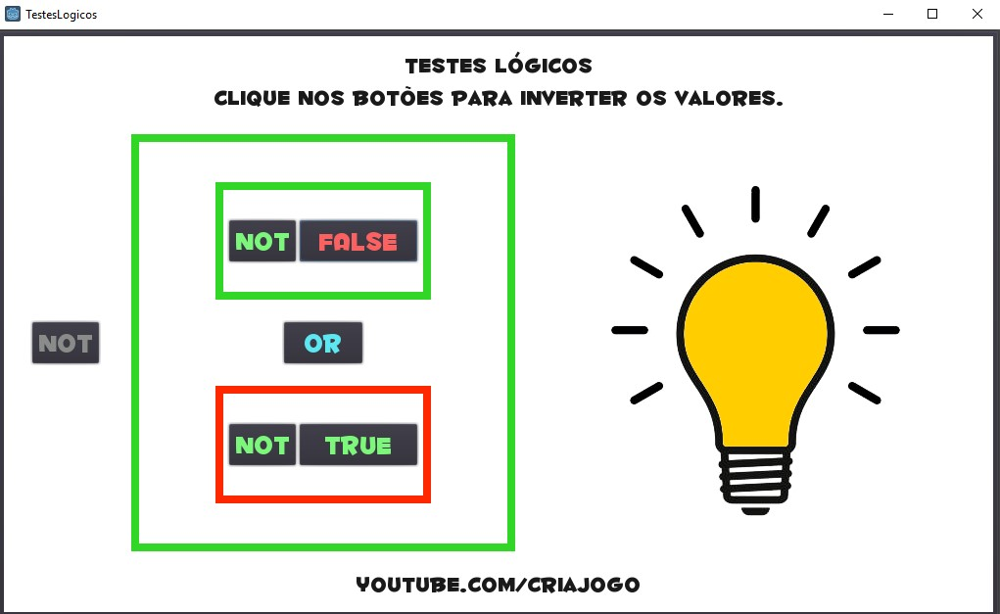

# BooleanLogicGame
A small game made in Godot to teach and to help visualize boolean values in programming logic.

## CREDITOS
* [CODIGO FONTE BAIXADO DE GITHUB](https://github.com/alfredbaudisch/BooleanLogicGame)
* [MINIGAME BAIXADO DE SITE](https://www.youtube.com/redirect?event=video_description&redir_token=QUFFLUhqbTJGRzNRZVNYZXFLODFvZC1EUTJTc20xMVZCUXxBQ3Jtc0trX3lkWHNfdzJoY3RFdVpETHY4ZFItYzQwRkUxSXlBRy1NZmoyYlh4cHNMOHRDTVZxZGtEb3dzNkRoZUp0STd4RkNtTVFCVmNxbzUyOE5WekVpNUxCWjh6blRlWnlrRXR0NFhzWlhoTjJzQmZkRVBfdw&q=https%3A%2F%2Fgithub.com%2Falfredbaudisch%2FBooleanLogicGame%2Freleases%2Fdownload%2F1.0%2FTestesLogicos-windows.zip&v=zNPjqag7i7c)
* [JOGUE NO NAVEGADOR](https://www.youtube.com/redirect?event=video_description&redir_token=QUFFLUhqbEY3LWI4Ulk5UzJPeV8weFpxT1l5T2FLeWNmQXxBQ3Jtc0trb0N1ak90RnJxaVJjeGYyOXVMUWRpRUVWNUFhMXp0X3MxTXpVODd2RFc0VEppS3F4U3EzVlFoRE5JblBjYW5hRE9RWGs1UUVFMUxpQlhPTDJraFBfdGxCZTl6QXU3WW1HdGJuVTVaQWtfdDlpZlZYTQ&q=https%3A%2F%2Fcriajogo.com%2Farquivos%2Fgames%2Ftestes-logicos%2F&v=zNPjqag7i7c)
