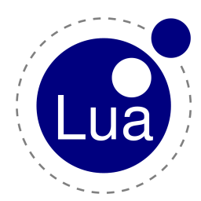

# CURSO DE LUA
👨‍⚖️LUA É UMA LINGUAGEM DE PROGRAMAÇÃO.

  

## VISÃO PANORÂMICA:
| PERGUNTA | RESPOSTA |
| :---: | :---: |
| DATA DE CRIAÇÃO | 1993 |
| NOME DO CRIADOR | Roberto Ierusalimschy, Luiz Henrique de Figueiredo e Waldemar Celes | 
| SIGNIFICADO DO NOME | "Lua" significa "lua" em português, a língua nativa dos criadores. |
| É BASEADA NO | Pascal, Modula, C, e awk |
| EXTENÇÃO DO ARQUIVO | .lua |
| É MAIS USADA | Desenvolvimento de Jogos |

- **Data de criação:** Lua foi criada em 1993.

- **Nome do criador:** Lua foi desenvolvida por Roberto Ierusalimschy, Luiz Henrique de Figueiredo e Waldemar Celes.

- **Significado do nome:** "Lua" significa "lua" em português, a língua nativa dos criadores. O nome foi escolhido porque a lua é frequentemente associada a algo que é pequeno e simples, refletindo a filosofia de design da linguagem.

- **Baseada em:** Lua é uma linguagem de programação de script que foi influenciada por várias outras linguagens, incluindo Pascal, Modula, C, e awk.

- **Extensão do arquivo:** Os arquivos Lua geralmente têm a extensão ".lua".

- **Usos principais:** Lua é usada em várias áreas, incluindo desenvolvimento de jogos, automação de software, scripting em aplicativos como o World of Warcraft e Adobe Lightroom, sistemas embarcados, desenvolvimento web e muito mais. Sua simplicidade, eficiência e capacidade de ser incorporada em outros programas a tornam uma escolha popular para várias aplicações.

Lua é conhecida por sua facilidade de aprendizado e uso, tornando-a uma excelente escolha para iniciantes em programação, bem como para profissionais experientes que desejam adicionar funcionalidade de script a seus projetos. É uma linguagem versátil que encontrou uso em uma variedade de setores devido à sua portabilidade e desempenho.

## SUA HISTÓRIA:
1. **Origens (1993)**:
   - Lua foi desenvolvida por um grupo de pesquisadores brasileiros da Pontifícia Universidade Católica do Rio de Janeiro (PUC-Rio), incluindo Roberto Ierusalimschy, Waldemar Celes e Luiz Henrique de Figueiredo.
   - A ideia era criar uma linguagem de script poderosa e fácil de usar para facilitar a programação em diversas áreas, especialmente em sistemas embarcados e jogos.

2. **Lançamento Público (1993)**:
   - Lua foi lançada pela primeira vez publicamente em 1993, com a versão 1.0.
   - A linguagem atraiu a atenção devido à sua sintaxe limpa, simplicidade e desempenho.

3. **Princípios de Design**:
   - Lua foi projetada com alguns princípios importantes em mente, incluindo simplicidade, portabilidade, eficiência e extensibilidade.
   - Seu design elegante e minimalista torna-a fácil de aprender e usar, enquanto sua capacidade de ser incorporada em outras aplicações a torna extremamente versátil.

4. **Adoção e Popularidade**:
   - Lua ganhou popularidade rapidamente devido à sua natureza flexível e ao suporte de uma comunidade de desenvolvedores ativos.
   - A linguagem foi adotada em uma ampla variedade de campos, incluindo jogos, desenvolvimento web, automação, sistemas embarcados e muito mais.

5. **Lua 5.0 (2003)**:
   - O lançamento da versão 5.0 do Lua marcou um marco importante na evolução da linguagem.
   - Introduziu recursos poderosos, como coleta de lixo incremental, manipulação de metatabelas e suporte a Unicode.

6. **LuaJIT (2005)**:
   - O LuaJIT é um compilador Just-In-Time para Lua, desenvolvido por Mike Pall.
   - Ele oferece um desempenho significativamente melhor do que o interpretador padrão Lua, tornando Lua uma escolha ainda mais atraente para aplicativos que exigem alta velocidade de execução.

7. **Continuação do Desenvolvimento**:
   - Lua continua a ser desenvolvida ativamente, com novas versões sendo lançadas regularmente para adicionar recursos, melhorar a eficiência e corrigir bugs.

8. **Adoção em Jogos**:
   - Lua é amplamente utilizada na indústria de jogos como uma linguagem de script para controle de comportamentos, criação de mods e prototipagem rápida de jogos.

9. **Adoção em Sistemas Embarcados**:
   - Devido à sua portabilidade e eficiência, Lua é frequentemente usada em sistemas embarcados para configurar e controlar dispositivos, como roteadores, TVs inteligentes e impressoras.

## CARACTERISTICAS:
### POSITIVAS:
1. **Simplicidade e Legibilidade:** Lua é conhecida por sua sintaxe simples e legível, o que a torna fácil de aprender e usar. É uma linguagem minimalista com uma quantidade limitada de construções, o que a torna acessível até mesmo para iniciantes em programação.

2. **Portabilidade:** Lua é altamente portátil e pode ser executada em várias plataformas, incluindo Windows, macOS, Linux e até mesmo em sistemas embarcados. Isso a torna uma escolha popular para desenvolvimento multiplataforma.

3. **Leveza:** A implementação padrão da Lua é extremamente leve e consome poucos recursos de sistema. Isso a torna adequada para sistemas com recursos limitados, como jogos, sistemas embarcados e dispositivos móveis.

4. **Alta Performance:** Apesar de ser uma linguagem interpretada, Lua é notável por sua alta performance, graças a seu compilador just-in-time (JIT). Isso a torna adequada para aplicativos que exigem velocidade e eficiência.

5. **Integração com outras linguagens:** Lua possui uma API C que permite a integração fácil com outras linguagens, como C/C++, tornando-a uma escolha popular para extensibilidade e scripting em jogos e aplicativos.

6. **Suporte a Programação Funcional:** Lua suporta programação funcional, permitindo que você trate funções como valores de primeira classe e use funções anônimas (closures).

7. **Suporte a Orientação a Objetos:** Embora Lua não seja uma linguagem de programação orientada a objetos pura, ela oferece suporte para programação orientada a objetos usando tabelas e metatabelas, permitindo a criação de sistemas orientados a objetos.

8. **Comunidade Ativa:** Lua tem uma comunidade ativa de desenvolvedores e uma vasta coleção de bibliotecas e módulos disponíveis, o que facilita a resolução de problemas e a expansão de funcionalidades.

9. **Licença Permissiva:** Lua é distribuída sob uma licença permissiva (a Licença MIT), o que significa que você pode usá-la livremente em projetos comerciais e de código aberto sem muitas restrições.

10. **Documentação Abundante:** Lua possui uma documentação extensa e de alta qualidade, incluindo tutoriais, manuais e exemplos que facilitam a aprendizagem e a referência.

Essas características positivas fazem de Lua uma escolha atraente para uma variedade de aplicações, desde desenvolvimento de jogos e sistemas embarcados até automação de tarefas e desenvolvimento de scripts. Ela é uma linguagem versátil e poderosa que continua a ser amplamente usada em muitos campos.

### NEGATIVAS:
1. **Falta de Tipagem Estática:** Lua é uma linguagem de tipagem dinâmica, o que significa que os tipos das variáveis são determinados em tempo de execução. Isso pode levar a erros difíceis de detectar durante a fase de desenvolvimento, especialmente em programas maiores.

2. **Menos Recursos de Biblioteca Padrão:** Comparada a algumas outras linguagens, Lua possui uma biblioteca padrão mais enxuta. Isso significa que você pode precisar depender de bibliotecas externas para realizar tarefas específicas, o que pode aumentar a complexidade do projeto.

3. **Ausência de Recursos de Multithreading:** Lua não possui suporte nativo para multithreading ou concorrência. Isso pode ser uma limitação em aplicativos que exigem a execução simultânea de várias tarefas em CPUs modernas com vários núcleos.

4. **Documentação Limitada para Alguns Módulos:** Embora a documentação oficial de Lua seja de alta qualidade, algumas bibliotecas e módulos de terceiros podem não ter uma documentação tão abrangente, o que pode dificultar o uso de certas funcionalidades.

5. **Aprendizado de Novos Conceitos:** Lua usa metatabelas e conceitos específicos para implementar recursos de programação orientada a objetos, o que pode ser confuso para programadores que não estão familiarizados com esses conceitos.

6. **Gerenciamento Manual de Memória:** Em Lua, o gerenciamento de memória é feito manualmente, o que pode levar a vazamentos de memória se não for feito corretamente. Isso pode ser especialmente desafiador em projetos complexos.

7. **Limitações de Desempenho em Aplicações Altamente Computacionais:** Embora Lua seja rápida para muitas tarefas, ela pode não ser a escolha ideal para aplicativos que requerem alto desempenho computacional, como simulações científicas complexas.

8. **Ecossistema Menos Abundante:** Em comparação com linguagens mais populares, como Python ou JavaScript, o ecossistema de Lua é menos expansivo, o que significa que pode ser mais difícil encontrar recursos, bibliotecas e desenvolvedores experientes.

9. **Não é Tão Conhecida para Desenvolvimento Web:** Lua não é tão conhecida ou amplamente usada para desenvolvimento web como algumas outras linguagens, como JavaScript ou PHP. Isso pode limitar suas opções ao escolher uma linguagem para criar aplicativos web.

10. **Tamanho da Comunidade Menor:** A comunidade Lua é menor em comparação com algumas linguagens mais populares, o que pode significar menos suporte da comunidade e menos recursos disponíveis.

## SUBSIDIOS:
- [CURSO CRIADO PELO "ALFRED BAUDISCH (PARDALL)"](https://www.youtube.com/playlist?list=PLqYboeh3Jru55Yq4J08zsBoOwwwjUtZNA)
- [CURSO FEITO PELO VILHALVA](https://github.com/VILHALVA)
- [VEJA A DOCUMENTAÇÃO](https://www.lua.org/docs.html)
- [VEJA A SINTAXE](./SINTAXE.md)
